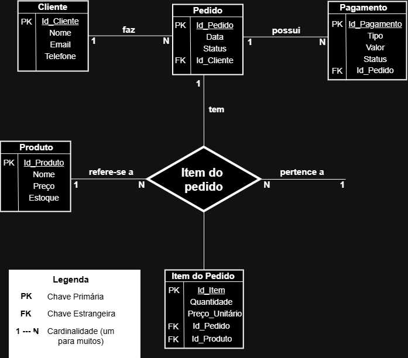

# 🛒 Simulação de Lojinha Online (Arquitetura Monolítica)

## 📌 Introdução e Contexto do Trabalho

Este projeto foi desenvolvido como uma atividade prática com o objetivo de evoluir a modelagem de um sistema de e-commerce (Lojinha Online) a partir de um Diagrama de Contexto (N0) inicial. 

O foco do trabalho abrange desde a modelagem conceitual e lógica do sistema até a sua implementação funcional simulada. Para isso, o projeto foi dividido na entrega de quatro artefatos principais:
1. **Diagrama de Atividades (UML):** Representando o fluxo principal de navegação e compra.
2. **Diagrama Entidade-Relacionamento (DER):** Modelando a estrutura de dados persistente.
3. **Simulação em Java:** Uma API simulando o backend do sistema.
4. **Aplicação de Padrões de Projeto:** Uso obrigatório do padrão *Singleton* para o gateway de pagamento.

---

## 📖 Conceitos Fundamentais

### O que é uma Lojinha Online?
No contexto deste sistema, uma "lojinha online" é uma plataforma de comércio eletrônico (e-commerce) simplificada que permite a um cliente realizar todo o fluxo de compra de maneira digital. O sistema é responsável por gerenciar a identificação do cliente, exibir o catálogo de produtos disponíveis, registrar o pedido, calcular os valores e coordenar a comunicação com um sistema externo para o processamento e validação do pagamento.

### O que é uma Arquitetura Cliente-Servidor Monolítica?
A arquitetura base escolhida para este projeto é a **Cliente-Servidor Monolítica**. Ela se define por duas características principais:

* **Cliente-Servidor:** Existe uma separação clara entre quem consome o serviço (o Cliente, que pode ser um navegador ou aplicativo) e quem processa as regras de negócio e acessa o banco de dados (o Servidor).
* **Monolítica:** Refere-se à forma como o backend (servidor) é construído. Em um monólito, **todas as responsabilidades e módulos do sistema estão agrupados em uma única base de código e executados como um único processo**. Ou seja, as funções de listagem de produtos, gerenciamento de carrinho, criação de pedidos e a integração com o pagamento compartilham a mesma memória e o mesmo espaço de aplicação. É uma arquitetura excelente para sistemas iniciais por ser mais simples de desenvolver, testar e fazer o *deploy* (implantação).

---

## 📁 Estrutura do Projeto

Neste repositório, você encontrará a seguinte estrutura de arquivos:

* `docs/`: Contém as imagens do Diagrama de Atividades (UML) e do Diagrama Entidade-Relacionamento (DER).
* `src/`: Contém o código-fonte da simulação desenvolvida em Java.
* `README.md`: Documentação principal do projeto.

---

## 🏗️ Principais Decisões Arquiteturais e Padrões de Projeto

* Inserir aqui a justificativa do uso do padrão Singleton no sistema de pagamento, conforme definido na divisão do trabalho).*

---

## 🗄️ Diagrama Entidade-Relacionamento (DER)

 O Diagrama Entidade-Relacionamento (DER) representa a estrutura de dados do sistema, definindo como as informações são organizadas, armazenadas e relacionadas dentro da lojinha online.

 Este modelo foi projetado para refletir o fluxo real de uma compra em um e-commerce, desde o cadastro do cliente até o pagamento do pedido.

---

  

---

## 📦 Entidades Principais

 O sistema é composto pelas seguintes entidades:

* **Cliente**
Armazena as informações dos usuários que realizam compras no sistema.
Cada cliente possui dados como nome, e-mail e telefone.
* **Pedido**
Representa uma compra realizada por um cliente.
Um pedido possui data, status e está sempre associado a um cliente.
* **Produto**
Contém os itens disponíveis para venda na loja.
Cada produto possui nome, preço e quantidade em estoque.
* **Pagamento**
Representa o processamento financeiro de um pedido.
Inclui informações como tipo de pagamento, valor e status.
* **Item do Pedido**
Entidade responsável por resolver o relacionamento entre pedidos e produtos.
Ela armazena quais produtos foram comprados, em qual quantidade e por qual valor unitário.

---

## 🔗 Relacionamentos e Cardinalidades

 O DER define como essas entidades se conectam:

* **Cliente → Pedido (1:N)**
Um cliente pode realizar vários pedidos, mas cada pedido pertence a apenas um cliente.
* **Pedido → Pagamento (1:N)**
Um pedido pode possuir um ou mais pagamentos (ex: tentativa, parcelamento, etc.), mas cada pagamento está vinculado a um único pedido.
* **Pedido → Item do Pedido (1:N)**
Um pedido é composto por vários itens, representando os produtos comprados.
* **Produto → Item do Pedido (1:N)**
Um produto pode estar presente em vários pedidos diferentes.

---

## 🔄 Relacionamento Muitos-para-Muitos

 O relacionamento entre Pedido e Produto é do tipo muitos-para-muitos, já que um pedido pode conter vários produtos e, ao mesmo tempo, um produto pode estar presente em diversos pedidos. Para resolver essa relação, foi criada a entidade Item do Pedido, que atua como uma tabela intermediária.
 Essa entidade permite registrar, de forma organizada, quais produtos compõem cada pedido, incluindo informações importantes como a quantidade e o preço unitário no momento da compra. Além de garantir a integridade dos dados, essa abordagem também preserva o histórico das transações, evitando que alterações futuras no preço dos produtos afetem pedidos já realizados.

---

## 🧠 Decisões de Modelagem

* Algumas decisões importantes foram tomadas durante a construção do DER:

* A separação de **Item do Pedido** evita redundância e permite maior flexibilidade no sistema.
* O armazenamento do **preço unitário** no item garante que alterações futuras no preço do produto não afetem pedidos antigos.
* A entidade **Pagamento** foi desacoplada do pedido para permitir evolução futura, como suporte a múltiplas formas de pagamento.

---

